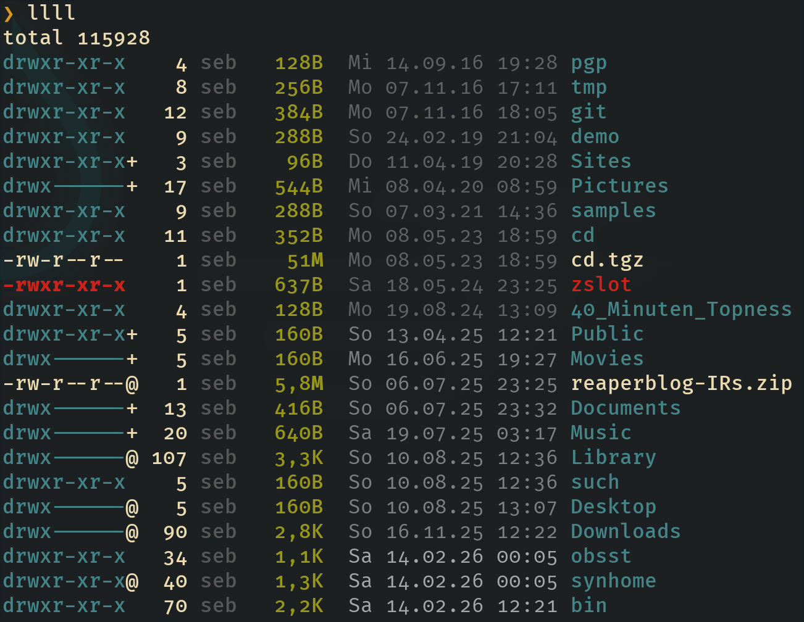

# llll

Colorful ls using the system /bin/ls.

No need to install extra binaries just because you want to see some rainbows on
your terminal.

We use the coloring that /bin/ls can do by itself and add missing colors using sed.


(llll in gruvbox colored terminal on mac OS)

## Features

- "Long" style (`-l`) suitable for use as the common ll alias
- Blue color for directory permissions
- Executables colored in red
- Username in dark grey if it is yourself, otherwise in normal foreground color
- Sizes in green. For very large files (**M**ega- or **G**igabtyes) the unit is
  printed in bold
- The date is shown in light gray for this years files, a bit darker for last
  years files and even darker for older files
- File and directory names are shown like colored by the underlying /bin/ls program
- Works on Linux and macos (probably also BSD, although untested)

Except for the gray colors, the "normal" colors 0-15 are used, so the exact
look will change with your terminal color theme.

## Setup

Drop somewhere in $PATH. You need zsh installed.

A common alias would be `ll=llll`.

On Mac/BSD, you probably want to set the environment variable LSCOLORS to something like:

```
LSCOLORS=exfxcxdxbxegedabagacad
```

On Linux, you can achieve the same with dircolors(1) and the LS_COLORS variable. A basic
setup would be:

```
eval $(dircolors)
```

## Restrictions

The way this works comes with some downsides. Some assumptions need to be made
in order to make the regular expressions for modifying the output not too
complex. So the format is pretty much fixed.

I tested this with locales `C.UTF-8`, `en_US.UTF-8` and `de_DE.UTF-8` on Manjaro Linux and Mac OS 15.7.4. Other locales or OSes might work or not.
